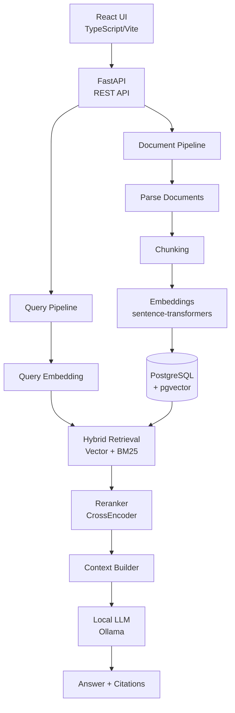

# Enterprise Architecture RAG Copilot

> An AI assistant for enterprise software architecture — powered by local LLMs, hybrid retrieval, and RAG.

[](LICENSE)
[](https://www.python.org/)
[](https://fastapi.tiangolo.com/)
[](https://reactjs.org/)

---

## What This Project Solves

Enterprise teams maintain vast amounts of technical documentation — ADRs, architecture diagrams, service specs, API definitions, security policies, infrastructure files. Finding relevant information across these documents is slow and error-prone.

This project provides an AI assistant that:

- **Indexes** technical documentation (PDF, Markdown, YAML, JSON, Terraform, etc.)
- **Retrieves** relevant evidence using hybrid search (semantic + keyword)
- **Generates** grounded answers with source citations
- **Never fabricates** architecture facts — if the answer isn't in the documents, it says so

---

## Architecture



---

## RAG Pipeline

```
Documents
  → Parsing       (PDF, Markdown, YAML, JSON, Terraform)
  → Chunking      (section-aware, configurable size/overlap)
  → Embeddings    (BAAI/bge-small-en-v1.5, local CPU)
  → pgvector      (stored with metadata)

Query
  → Embedding
  → Vector Search   (pgvector cosine similarity)
  +
  → BM25 Search     (keyword retrieval)
  → Hybrid Merge    (weighted score fusion)
  → Reranking       (CrossEncoder, top 20 → top 5)
  → Context Builder (structured with citations)
  → Ollama LLM      (local, grounded answer)
  → Answer + Citations
```

### Why Hybrid Search?

| Method | Strength | Weakness |
|--------|----------|----------|
| Vector search | Understands meaning, handles synonyms | Misses exact keywords (e.g. "ADR-003") |
| BM25 | Precise keyword matching | No semantic understanding |
| **Hybrid** | **Best of both** | Requires score fusion |

### Why Reranking?

Retrieving 20 candidates and reranking them with a CrossEncoder significantly improves final context quality because:
- The initial retrievers use approximate methods (ANN, BM25) optimized for recall
- CrossEncoders do full query-document comparison, not just embedding similarity
- Top-5 after reranking is more precise than top-5 from initial retrieval

---

## Technology Stack

| Component | Technology |
|-----------|-----------|
| Backend | FastAPI, Python 3.11, SQLAlchemy, Pydantic |
| Database | PostgreSQL 16 + pgvector |
| Embeddings | sentence-transformers (BAAI/bge-small-en-v1.5) |
| Reranker | sentence-transformers CrossEncoder (BAAI/bge-reranker-base) |
| Keyword Search | BM25 (rank_bm25) |
| LLM | Ollama (llama3.2 or configurable) |
| Frontend | React 18, TypeScript, Vite, Tailwind CSS |
| Infrastructure | Docker, Docker Compose |

---

## Setup

### Prerequisites

- [Docker Desktop](https://www.docker.com/products/docker-desktop/)
- [Ollama](https://ollama.ai/) (or use the bundled Docker service)

### 1. Clone and configure

```bash
git clone <repo-url>
cd enterprise-rag-copilot
cp .env.example .env
```

### 2. Pull the LLM model

```bash
# Pull Ollama model before starting (do this once)
docker compose run --rm ollama ollama pull llama3.2
```

Or if Ollama is installed locally:
```bash
ollama pull llama3.2
```

### 3. Start all services

```bash
docker compose up --build
```

### 4. Access

| Service | URL |
|---------|-----|
| Frontend | http://localhost:3000 |
| Backend API | http://localhost:8000 |
| API Docs | http://localhost:8000/docs |
| Health Check | http://localhost:8000/health |

---

## Example Questions

Once you've uploaded your architecture documents, ask:

- *"Why was Kafka selected?"*
- *"Which services depend on Kafka?"*
- *"What database does the Order Service use?"*
- *"What authentication mechanism is used?"*
- *"What happens if the Auth Service becomes unavailable?"*
- *"Which ADR explains the decision to use Kubernetes?"*

---

## Evaluation

Run the evaluation suite:

```bash
# From inside the running backend container
docker compose exec backend python scripts/evaluate.py
```

Results are saved to `data/evaluation/results.json`.

---

## Running Tests

```bash
docker compose exec backend pytest
```

---

## Configuration

All settings are configurable via `.env`:

| Variable | Default | Description |
|----------|---------|-------------|
| `OLLAMA_MODEL` | `llama3.2` | Local LLM model |
| `EMBEDDING_MODEL` | `BAAI/bge-small-en-v1.5` | Embedding model |
| `RERANKER_MODEL` | `BAAI/bge-reranker-base` | CrossEncoder model |
| `CHUNK_SIZE` | `800` | Characters per chunk |
| `CHUNK_OVERLAP` | `100` | Overlap between chunks |
| `VECTOR_WEIGHT` | `0.6` | Weight for vector search |
| `BM25_WEIGHT` | `0.4` | Weight for BM25 |
| `RETRIEVAL_TOP_K` | `20` | Candidates before reranking |
| `RERANK_TOP_K` | `5` | Final chunks after reranking |

---

## Limitations

- Runs on CPU by default — embedding and reranking are slower than GPU
- LLM quality depends on the Ollama model chosen
- No authentication on the API (MVP)
- No streaming responses (planned)
- No multimodal document support (images in PDFs are ignored)

---

## Future Work

- [ ] Agentic retrieval (multi-hop reasoning)
- [ ] Query decomposition for complex questions
- [ ] Multimodal document understanding
- [ ] Graph RAG (entity-relationship aware retrieval)
- [ ] Streaming LLM responses
- [ ] Authentication & multi-tenancy
- [ ] AWS/GCP deployment guide
- [ ] Enterprise observability (OpenTelemetry)
- [ ] Confluence / Jira / Notion connectors
- [ ] Feedback loop for retrieval improvement

---

## Project Status

| Phase | Status | Description |
|-------|--------|-------------|
| Phase 1 | ✅ | Foundation — Docker, FastAPI, React |
| Phase 2 | 🔄 | Database — SQLAlchemy, pgvector |
| Phase 3 | ⏳ | Document Ingestion |
| Phase 4 | ⏳ | Embeddings |
| Phase 5 | ⏳ | Vector Retrieval |
| Phase 6 | ⏳ | BM25 |
| Phase 7 | ⏳ | Hybrid Search |
| Phase 8 | ⏳ | Reranking |
| Phase 9 | ⏳ | LLM Generation |
| Phase 10 | ⏳ | Frontend |
| Phase 11 | ⏳ | Evaluation |
| Phase 12 | ⏳ | Finalization |

---

## License

MIT

